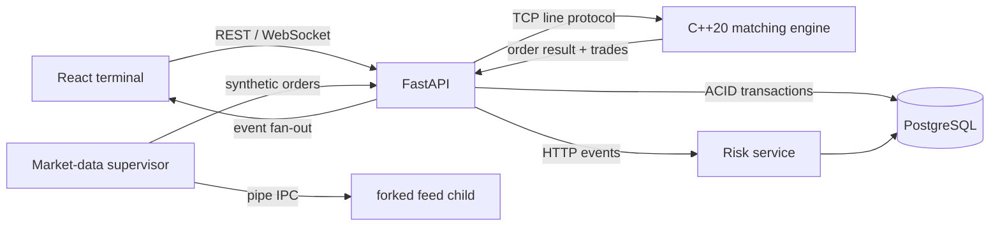

# APEX Exchange Architecture

APEX is a locally runnable electronic exchange whose source of truth for matching is a
C++20 service. FastAPI coordinates durable PostgreSQL state and fan-out, a Python risk
worker detects anomalous account activity, and a React terminal consumes REST and
WebSocket APIs.

## Service contracts

- **matching-engine** owns live books. Commands are newline-delimited, pipe-separated
  records over TCP; responses are one-line JSON. Books are assigned to stable worker
  shards, preserving per-symbol ordering while processing different symbols concurrently.
- **api** validates requests, reserves buy-side funds or long-only sell inventory, calls
  the engine, and persists the returned order/trades/position changes in one database
  transaction. It broadcasts committed events only after commit.
- **risk-service** accepts actual order/trade/cancel observations, maintains rolling
  account windows, writes statistically-derived risk events, and remains useful without
  an LLM.
- **frontend** is a compact trading workstation using the REST and WebSocket contracts.
- **simulator** demonstrates useful process isolation: a supervisor forks feed generators,
  consumes pipe-framed order flow, reaps/restarts children, and forwards data to the API.

## Correctness boundaries

Matching is deterministic within a symbol. API request IDs are unique. PostgreSQL row
locks serialize account reservations and position mutations; active sell orders are the
reservation ledger and a check constraint prevents negative positions. Database IDs use
identity columns; engine order/trade IDs use process-wide atomics. Events are published
only after durable commit.

See `docs/architecture.md` for the detailed flow and tradeoffs.
