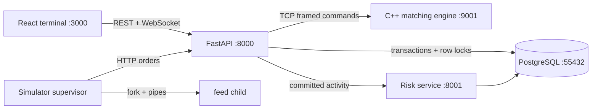

# APEX Exchange

APEX is a working local electronic exchange centered on a multithreaded C++20 matching
engine. It accepts live orders through FastAPI, matches by price-time priority, settles
cash and positions transactionally in PostgreSQL, streams committed events over
WebSockets, detects behavioral anomalies, and renders the result in a React trading
terminal.

This repository is intentionally systems-heavy: matching is not reimplemented in Python,
prices are integer ticks, same-price orders are FIFO, symbols are sharded across engine
workers, database mutations use real row locks and atomic updates, and the simulator uses
real POSIX processes and pipe IPC.

## Architecture



The API gives each order a PostgreSQL identity before routing it; that durable ID is also
the engine ID. A per-symbol API sequencer encloses engine submission and settlement, while
different symbols remain concurrent. Inside the engine, stable hash sharding sends each
symbol to one FIFO worker queue. See [ARCHITECTURE.md](ARCHITECTURE.md) and
[docs/architecture.md](docs/architecture.md).

## Features

- C++20 limit/market matching, partial fills, cancellation, self-trade prevention, FIFO
  price levels, unique IDs, snapshots, invariants, and structured service logs.
- Concurrent symbol workers built from `std::thread`, mutexes, condition variables,
  futures, atomics, and a thread-safe job queue.
- PostgreSQL identity keys, foreign/check/unique constraints, indexes, cash and long-only
  sell reservation, ordered `FOR UPDATE` locking, atomic position updates, and a
  transactional outbox.
- FastAPI validation and the required account/order/trade/position/instrument/risk/health
  endpoints; WebSocket topics for market, trades, orders, and risk.
- Statistical risk detection for order rate, cancellation ratio, and volume z-score.
  Optional OpenAI-compatible explanations are configured only through environment values;
  the default path is entirely local.
- A supervised `fork()` simulator using pipes, `poll()`, PIDs, signals, `waitpid()`, child
  cleanup, and bounded abnormal-child restart.
- Prometheus metrics, JSON logs, health checks, unit/integration/concurrency/process tests,
  and a concurrent HTTP benchmark.

## Quick start

Requirements: Docker with Compose. C++20, Python 3.9+, and Node 22 are only needed for
host-side development.

```bash
cp .env.example .env             # optional; safe local defaults already exist
make run
docker compose ps                # wait until all five core services are healthy
```

Open the terminal at <http://localhost:3000>, API documentation at
<http://localhost:8000/docs>, and health at <http://localhost:8000/health>. PostgreSQL is
mapped to host port `55432` to avoid colliding with a common local installation.

### Normal mode

Normal mode starts the exchange and waits for user orders. It does not generate activity.

```bash
make run
make stop                        # keep the database volume
```

### Demo / simulation mode

Demo mode adds synthetic market participants. Their orders use the normal path—simulator
processes → FastAPI → C++ matching engine → PostgreSQL settlement → WebSockets and risk
analysis—so every book change and execution visible in the terminal is real exchange
activity. Prices are bounded synthetic demonstration data, not an external market feed or
a model of real price formation.

```bash
make demo                        # start the complete stack plus continuous simulation
docker compose logs -f simulator
```

The default generator targets four events/second across `AAPL`, `MSFT`, `NVDA`, and
`BTCUSD`. Dedicated seeded accounts 3 and 4 provide simulator liquidity and inventory, so
continuous traffic does not consume the interactive accounts' resources. Configure
`SIM_EVENTS_PER_SECOND`, `SIM_VOLATILITY`, `SIM_SYMBOLS`, `SIM_SEED`, `SIM_CHILDREN`,
`SIM_DEPTH_LEVELS`, `SIM_MAX_OPEN_PER_SYMBOL`, `SIM_MAKER_ACCOUNT`, and
`SIM_TAKER_ACCOUNT` in `.env`. A fixed seed makes each child feed deterministic. Set
`SIM_EVENTS_PER_CHILD` to a positive value only when a finite run is desired; its demo
default is `0` (continuous).

Old benchmark or test orders are deliberately preserved during ordinary startup. To
prepare a coherent recruiter demo, explicitly destroy only this Compose project's local
database volume, recreate the seeded accounts/instruments, and start simulation:

```bash
make demo-reset                  # DESTRUCTIVE: removes local APEX database/demo data
make demo
```

The reset is for disposable local development data only. Do not run it against an
environment whose PostgreSQL volume must be retained.

```bash
make reset                       # equivalent volume-removing reset without starting demo
docker compose --profile observability up -d prometheus
```

Seeded interactive accounts 1 and 2 each begin with $1,000,000.00 and long inventory in
`AAPL`, `MSFT`, `NVDA`, and `BTCUSD`. Simulator accounts 3 and 4 have separate demo cash
and inventory. APEX is long-only: an active sell order reserves its remaining quantity,
and the API rejects orders above the account's uncommitted settled position.

## API overview

| Method | Path | Purpose |
|---|---|---|
| `POST` | `/orders` | Validate, reserve, match, settle, and publish an order |
| `DELETE` | `/orders/{id}` | Cancel an active engine order and release cash |
| `GET` | `/orders`, `/orders/{id}` | Query durable order state |
| `GET` | `/orderbook/{symbol}` | Read the live C++ book |
| `GET` | `/trades`, `/trades/{symbol}` | Read executions |
| `GET` | `/positions/{account_id}` | Read owned, reserved-to-sell, and available positions |
| `GET` | `/accounts/{account_id}` | Read available/reserved cash |
| `GET` | `/instruments`, `/risk-events` | Reference and anomaly data |
| `GET` | `/health`, `/metrics` | Dependency health and Prometheus metrics |
| `WS` | `/ws` | Subscribe to `market`, `trades`, `orders`, and `risk` |

Example (prices are integer cents/ticks):

```bash
curl -X POST http://localhost:8000/orders \
  -H 'Content-Type: application/json' \
  -d '{"account_id":2,"symbol":"AAPL","side":"SELL","order_type":"LIMIT","quantity":10,"price_ticks":18500}'
```

## Development and validation

```bash
python3 -m venv .venv
.venv/bin/pip install -r requirements-dev.txt -r api/requirements.txt
(cd frontend && npm install)
make test                 # C++ stress, fork/pipe, Python unit, TypeScript production build
make integration-test     # requires running Compose; includes DB races and full WebSocket flow
make lint
make benchmark
```

The engine Docker build independently runs CMake, compilation, and CTest. The database
race tests deliberately launch 150 simultaneous debits against only 100 affordable units,
proving the atomic predicate admits exactly 100, and concurrently upsert 200 position
increments without a lost update.

## Benchmark

`benchmarks/load_test.py` controls concurrent clients and records JSON. Reproduce the
checked-in local run with:

```bash
.venv/bin/python benchmarks/load_test.py --orders 1000 --concurrency 20 --symbols 4 \
  --output benchmark-results/local-1000.json
```

The actual run saved in [benchmarks/results/2026-10-02-local.json](benchmarks/results/2026-10-02-local.json)
completed 1,000/1,000 requests: **412.59 orders/s**, **206.30 trades/s**, p50 **43.198 ms**,
p95 **84.767 ms**, and p99 **239.377 ms**. These are end-to-end HTTP/engine/database and
in-process event-fan-out measurements; risk delivery is scheduled before the response but
not awaited. They are not isolated engine claims.

## Repository map

```text
engine/       C++ domain model, books, sharded engine, TCP protocol, tests
api/          FastAPI orchestration, settlement, REST/WebSocket/metrics
risk/         rolling anomaly detector and optional explanation adapter
frontend/     React + TypeScript terminal and nginx image
database/     normalized migrations, seed data, concurrency tests
simulator/    fork/pipe feed supervisor and process test
benchmarks/   concurrent load generator and recorded results
tests/        cross-service end-to-end test
docs/         architecture, operations, API, database, risk, and cloud documentation
infrastructure/ Prometheus configuration
```

## Engineering notes

APEX uses an in-memory matching book and durable post-match ledger. Restarting the engine
therefore requires book replay/reconciliation before production use; local Compose starts a
clean engine and preserves PostgreSQL until reset. The current API process is the durable
per-symbol settlement sequencer, so horizontal API scaling would first move that role to a
partitioned command log. The scaling path is described in
[docs/cloud-architecture.md](docs/cloud-architecture.md).

Configuration is environment-only. `.env`, keys, build products, virtual environments,
modules, logs, and benchmark scratch output are ignored. No paid service is required.
